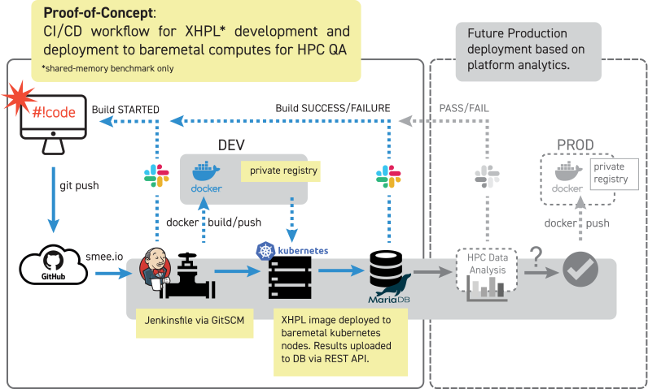

# deployxhpl
CI/CD Workflow POC for Dev Code Deployment

## About

This POC is a working model for code deployment (XHPL) to baremetal computes for the 
purpose of hardware QA in HPC environments. It uses my other repos: 
[engcommon](https://github.com/JustAddRobots/engcommon), 
[runxhpl](https://github.com/JustAddRobots/runxhpl), 
[runkubejobs](https://github.com/JustAddRobots/runkubejobs), and 
[xhplconsole-api](https://github.com/JustAddRobots/xhplconsole-api).

## Background

Since this project is intended for deployment to baremetal, parts of the workflow
are theoretically gated by hardware. In particular, a Kubernetes cluster can have
different hardware platforms for testing various XHPL builds (AVX2, AVX512, etc.). 
Currently this example deploys an unoptimised XHPL build to a K8S VM cluster.

Also at an institutional level, the workflow should have a single, accessible place
for INI configuration, as well as manual build/deployment options in the event of a
build server outage.

Thus the following requirements:

* Explicitly Versioned Container Images
* Institution-wide INI Configuration
* DB Integration for Future Data Analysis
* Manual Build/Deploy Failsafe

## Features

Based on the above requirements, the following are implemented:

* Gitflow Workflow w/ SemVer Container Tagging
* Jenkins Multibranch Pipeline
* Automatic Test Upload to SQL DB via REST API
* Manual Docker Build with Makefile (Failsafe)
* Manual Kubernetes Deployment w/ runkubejobs Package (Failsafe)

## Workflow in Action

### 01 Release candidate build/deploy

* git push
* docker build
* runkubejobs (runxhpl on k8s)

 

### 02 Check output

* local runxhpl logs
* SQL DB
* xhplconsole-api

### 03 Release

* release
* pull request/merge

## Todo

* Terraform/Packer implementation to make entire project portable and deployable
on a baremetal hypervisor or as IaaS/PaaS on a cloud provider.
